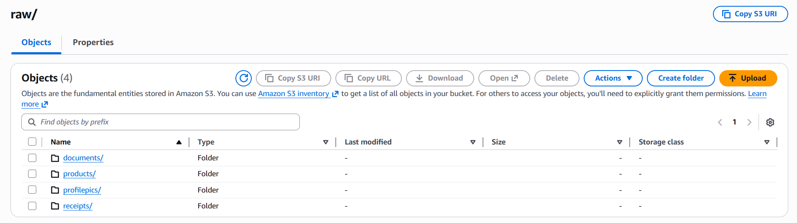
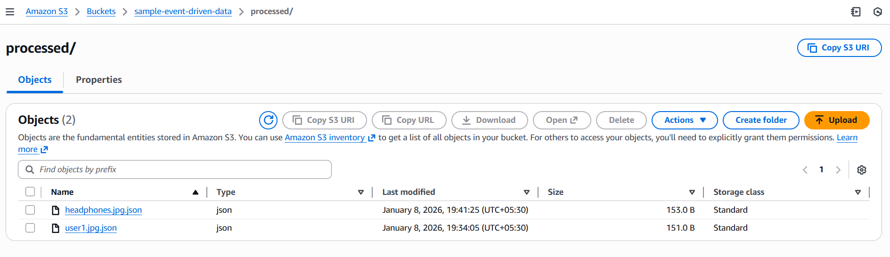
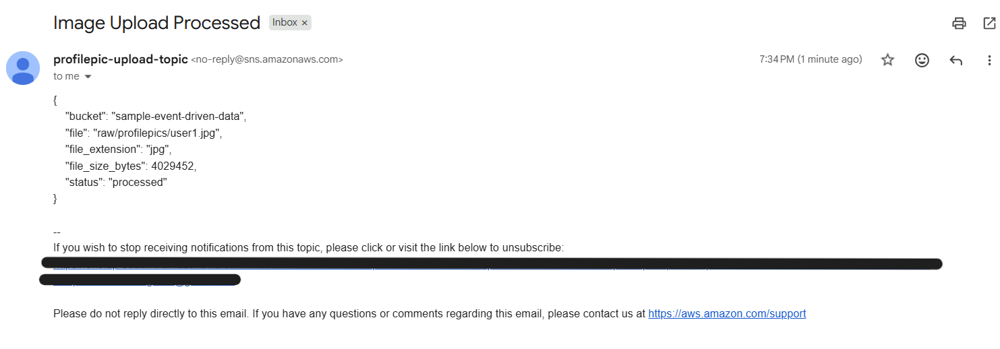

# Overview
Project is implementation of a small scale but complete event-driven ETL workflow, such that when an image is uploaded to specific folders inside the S3 bucket (products, documents, receipts, profile pictures), S3 triggers Lambda, which performs validation and metadata extraction, then routes notifications to the correct SNS topic.

Focus is on handling image uploads in real time, validating them, extracting metadata, and routing category-specific notifications — all without managing servers or infrastructure

When an image is uploaded inside the raw/ folder of Amazon S3, an event triggers a Lambda function.
The Lambda performs lightweight ETL:

-> Validates file type (jpg/jpeg/png)

-> Extracts metadata (file size, extension)

-> Writes a processed JSON file to the processed/ directory

-> Moves unsupported files to invalid/

-> Publishes a message to the correct SNS topic based on the folder prefix

## S3 Folder Structure
User uploads an image into the appropriate S3 folder

## S3 Trigger
S3 fires an event which invokes the Lambda processor.
1) Lambda checks:

=> file extension

=> folder prefix

Invalid files → invalid/ folder + SNS alert.

2) Using S3 head_object():

=> size in bytes

=> extension

=> object key

## SNS Topic
Lambda chooses the SNS topic based on folder prefix

products/ → PRODUCT_TOPIC  

documents/ → DOCUMENT_TOPIC  

receipts/ → RECEIPT_TOPIC

profilepics/ → PROFILE_TOPIC 

others → GENERAL_TOPIC

## SNS Flow Example
Sent to the appropriate SNS topic → delivered to email subscriber.

